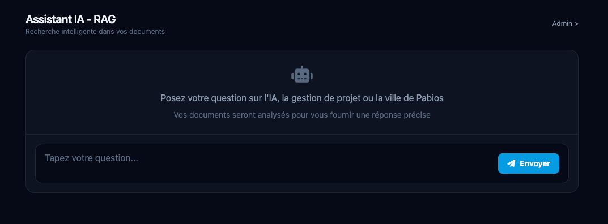
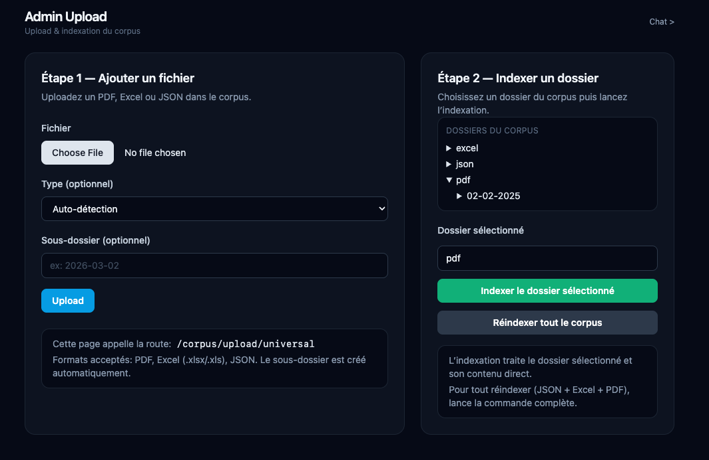

# Simple RAG


Un chatbot RAG minimal pour interroger vos documents (PDF / Excel / JSON) avec une UI propre et un mini espace admin.

## Aperçu

**Chat**


**Admin**


## Fonctionnalités

- Chat RAG avec sources
- Upload universel (PDF / Excel / JSON)
- Indexation ciblée par dossier (récursive)
- Réindexation complète du corpus

## Démarrage rapide

```bash
# 1) Configurer
cd backend
cp .env.example .env
# Ajoutez vos clés

# 2) Lancer
cd ..
docker compose up --build

# 3) Indexer (dev)
docker compose exec backend npm run index:dev
```

## Routes utiles

- `GET /` : Chat
- `GET /admin` : Admin (upload + indexation)
- `POST /corpus/upload/universal` : Upload (multipart/form-data)

## Indexation ciblée

```bash
# Indexer un sous-dossier PDF (dev)
npm run index:dev 2026-03-02
```

## .env (exemple)

```
OPENAI_API_KEY=...
EMBEDDING_MODEL=...
QDRANT_URL=...
DEFAULT_DOCUMENT_AUTHOR=...
ALLOWED_ORIGINS=https://example.com
APP_THEME=immobilier
WELCOME_MESSAGE=Bonjour ! Je suis votre assistant immobilier. Posez-moi votre question.
```

## Déploiement

- `compose.prod.yml` (Qdrant + corpus persistants)
- Dockerfiles séparés `docker/` (dev/prod)

---
MIT
